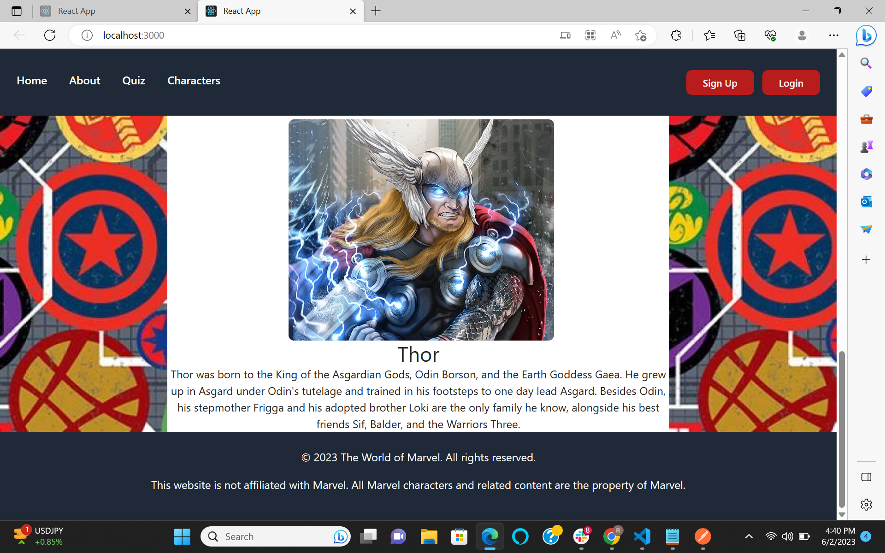

# Marvel-app

## User Story
Marvel has undeniably cemented its place as a cultural phenomenon in modern society. From an abundance of merchandise to the ever-present media coverage, the average person is frequently exposed to the captivating world of Marvel characters. With each character boasting a rich and intricate history, my team and I recognized the immense potential for a Marvel Wiki clone to cater to the ever-expanding Marvel fanbase.

Our vision is to create a platform where fans can delve deeper into their favorite Marvel characters, exploring their backgrounds, story arcs, and abilities. The Marvel Wiki clone will serve as a comprehensive resource, providing a treasure trove of information that satisfies even the most dedicated Marvel enthusiasts.

But our ambitions don't stop there. We aim to offer more than just a repository of character knowledge. Through our application, users will have the opportunity to create personalized profiles, allowing them to showcase their love for Marvel and connect with fellow fans. Imagine having a space where you can proudly display your favorite characters, share your thoughts on the latest Marvel releases, and engage in discussions with like-minded individuals. It's a dream come true for any Marvel fan.

Additionally, we understand the thrill of testing your Marvel knowledge and challenging yourself to see just how much you've absorbed from the vast Marvel universe. That's why we're incorporating interactive quizzes into our application. Users will have the chance to put their expertise to the test, answering trivia questions, and earning bragging rights among their peers. Whether you're a casual fan or a die-hard aficionado, our quizzes will provide entertainment and a chance to further immerse yourself in the Marvel experience.

So, whether you're seeking to learn more about the origins of your favorite characters, connect with other Marvel enthusiasts, or prove your Marvel prowess through engaging quizzes, our Marvel Wiki clone aims to fulfill your desires. Prepare to embark on a journey through the Marvel universe like never before. Join us and become part of a thriving community that celebrates the awe-inspiring world of Marvel.

## Project Description
The Marvel application is a web-based marvel experience developed utilizing a stack of cutting-edge technologies including React, Sequelize, Express, React Router, and Tailwind CSS. This meticulously crafted application offers a plethora of exciting features designed to captivate users and immerse them in the thrilling world of Marvel. Let's delve into the key functionalities it provides:

1. Marvel Character Search: With this feature, users can embark on a quest to explore and discover their favorite Marvel characters. The application offers a comprehensive search functionality, allowing users to delve into the extensive Marvel universe and learn more about their beloved superheroes and villains.

2. Quizzes for Marvel Fans: This feature promises an engaging and interactive experience for Marvel enthusiasts. Users can put their knowledge to the test through a series of captivating quizzes. These quizzes cover various aspects of the Marvel universe, challenging users to showcase their expertise and potentially unlock hidden Marvel trivia gems.

3. User Profile Creation: Marvel fans often relish the opportunity to express their admiration for their favorite characters and share their passion with like-minded individuals. The application provides a user profile feature, enabling users to build their own unique profiles. By creating a profile, users can personalize their Marvel experience, showcase their favorite characters, and connect with a vibrant community of fellow Marvel aficionados.

4. Seamless Navigation with React Router: React Router, a powerful routing library, ensures that users can effortlessly navigate through the Marvel application. It enables smooth transitions between different sections of the app, allowing users to explore various functionalities and content with ease.

5. Dynamic and Responsive UI with Tailwind CSS: The application boasts an aesthetically pleasing and user-friendly interface, thanks to the utilization of Tailwind CSS. This innovative CSS framework empowers developers to create stunning, responsive designs that adapt seamlessly to different screen sizes. Users can enjoy a visually captivating experience while browsing through Marvel characters, taking quizzes, and interacting with the app's features.

6. Robust Data Management with Sequelize and Express: Under the hood, Sequelize and Express work in tandem to provide efficient data management for the Marvel application. Sequelize, a promise-based ORM, facilitates seamless interaction with the underlying database, enabling smooth data retrieval and storage. Express, a minimalist web application framework, serves as the backbone of the application, handling HTTP requests and ensuring robust server-side functionality.

In summary, the Marvel application is an immersive web experience that merges the power of React, Sequelize, Express, React Router, and Tailwind CSS. It empowers users to explore the Marvel universe, test their knowledge through quizzes, build personalized user profiles, and navigate seamlessly through the application. Prepare to embark on an exciting journey through the Marvel cosmos with this feature-rich web application.

## Installation
1. Clone this repository: [marvel-app](https://github.com/Doylej16/Capstone.git)

2. Run `npm install` to install the dependencies
3. Cd marvel-app
3. Run `npm start` to start the application

## Technologies Used
- React: A popular JavaScript library for building user interfaces. React allows you to create reusable UI components and efficiently update and render them based on changes in data.

- Redux:A state management library for JavaScript applications. Redux helps you manage the state of your application in a predictable and centralized manner, making it easier to maintain and debug your code.

- React Router:A routing library for React applications. React Router enables you to handle client-side routing, allowing you to navigate between different components or pages without requiring a full page reload.

- Tailwind CSS:A utility-first CSS framework. Tailwind CSS provides a set of pre-defined utility classes that you can use to rapidly build responsive and custom-designed user interfaces.

- Express: A minimalist web application framework for Node.js. Express provides a simple and flexible way to handle HTTP requests, build APIs, and create web applications using JavaScript on the server-side.

- React-Dom:  A package that serves as the entry point for working with React in the browser. It provides methods for rendering React components and managing the DOM (Document Object Model) efficiently.

-React-Router-Dom:  A version of React Router specifically designed for web applications. It includes additional components and features to support routing in React applications running in the browser.

-PG: A PostgreSQL client for Node.js. PG allows you to interact with PostgreSQL databases from your Node.js applications, enabling you to perform database operations such as querying, inserting, updating, and deleting data.

-Framer-motion:  A motion library for React. Framer Motion provides a set of components and hooks that allow you to create smooth and interactive animations in your React applications.

-mysq12: A MySQL client for Node.js. mysql2 enables you to connect to and interact with MySQL databases from your Node.js applications, providing a convenient way to perform database operations

-Cors: A middleware for enabling Cross-Origin Resource Sharing (CORS) in Node.js. CORS allows web applications running on different domains to securely interact with each other.

-Axios: A popular HTTP client for JavaScript. Axios simplifies making HTTP requests from your applications and provides features such as interceptors, request cancellation, and automatic handling of response data.

-Bcrypt: A library for hashing passwords. Bcrypt provides secure password hashing functions that are resistant to brute-force attacks, helping you protect user passwords in your application.

-Sequelize: A promise-based ORM (Object-Relational Mapping) for Node.js. Sequelize allows you to interact with relational databases (such as PostgreSQL and MySQL) using JavaScript, providing an abstraction layer that simplifies database operations and allows you to work with models and relationships.

## Screenshots

## Contributing
Pull requests are welcome. For major changes, please open an issue first to discuss what you would like to change.

## License
MIT
